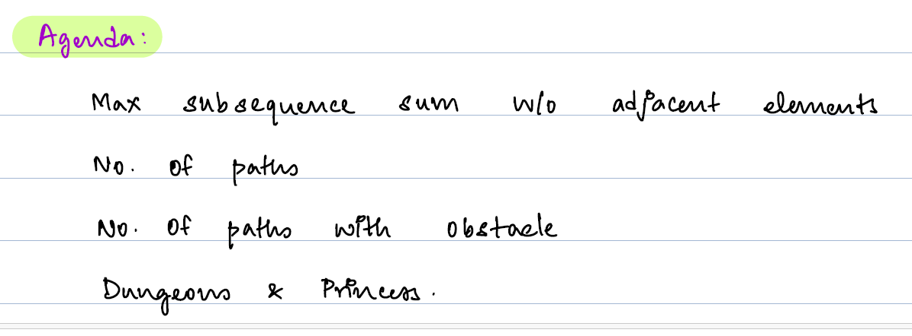

### Q. Given an Array find max subsequence sum.
Note : You are not allowed to pick adjacent elements.

### SubArray Vs Subsequence

##### Array - 9 4 13 3 1 9    
##### SubArray - 4 13 3 1  (SubArray is contigious element, follow input order)
##### SubSequence  - 9 13 3 9 (SubSequence is not contigious element, follow input order)

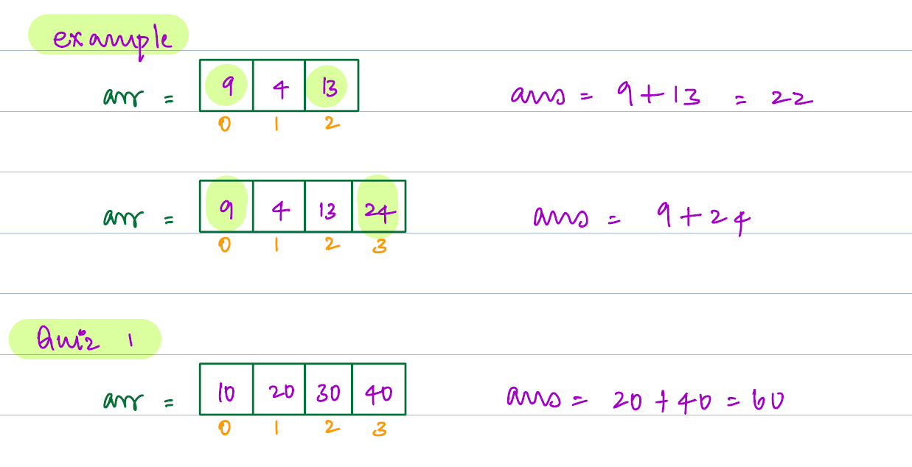

#### Observation :
Array : 2 -1 -4 5 3 -1 4 7

subSeqSum(0,n-1);

We will start picking element from last index, either we can pick the element or not pick.  
if pick element then arr[n-1]+ subSeqSum(0,n-3).  
if not pick the element then subSeqSum(0,n-2).

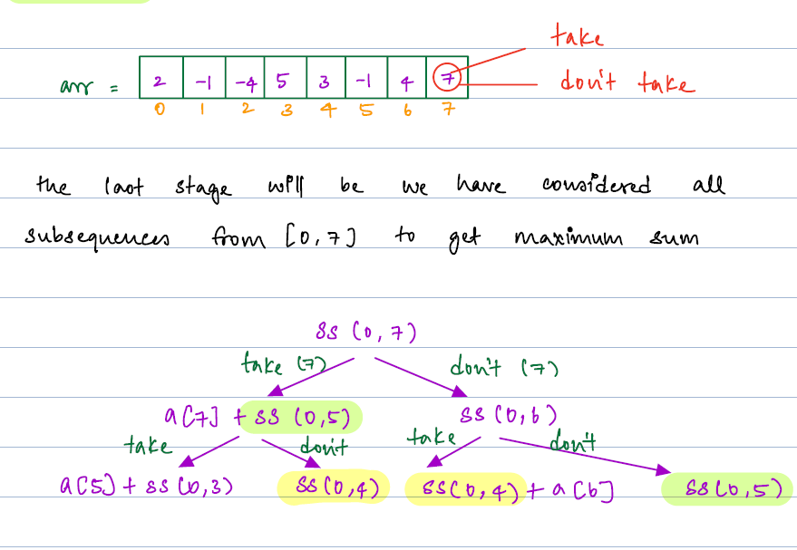

##### Optimal Substructure - Bigger problem can be solved using smaller problem.
#### Overlapping Subproblem - Repeating subproblem

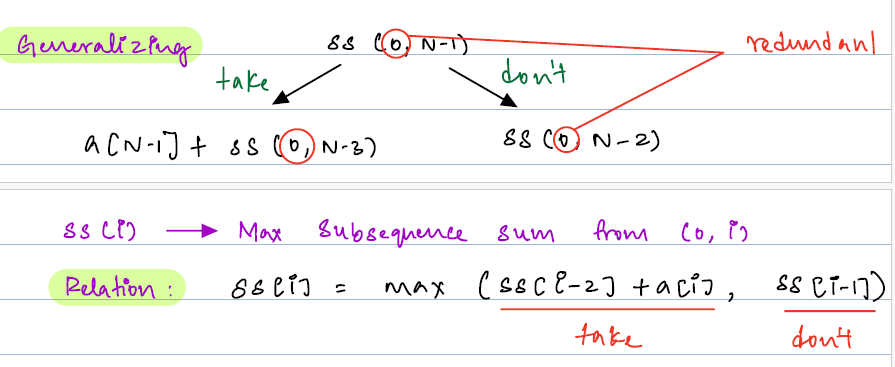

###### Generalization : if subSeqSum(0,N-1)   
                 take arr[N-1] + subSeqSub(0,N-3)  
                 not take subSeqSub(0,N-2)
##### Brute Force Approach
```java

int subSeqSum(int[] A, int i) {
 if(i<0) return 0;
 int take = A[i] + subSeqSum(A, i-2);
 int notTake = subSeqSum(A,i-1);
 return Math.max(take,notTake);
}
```
TC : O(2^N) , SC: O(N)
#### Dynamic Programming Approach
```java

int[] dp = new int[N+1];
Arrays.fill(dp,0);
int subSeqSub(int[] A,int i) {
    if(i<0) return 0;
    if(dp[i]!=0) return dp[i];
    int take = A[i] + subSeqSub(A,i-2);
    int notTake = subSeqSub(A,i-1);
    dp[i] = Math.max(take,notTake);
    return dp[i];
}
```
T.C : O(N), S.C : O(N)

#### Iterative Approach - Go from smallest element to Bigger problem
```java
int subSeqSub(int[] A) {
    int[] dp = new int[N];
    dp[0] = Math.max(A[0],0);
    int dp1 = Math.max(A[0],A[1]);
    dp[1] = dp1 < 0 ? Math.max(dp1,0): dp1;
    for(int i=2;i<N;i++) {
        int take = A[i] + dp[i-2];
        int notTake = dp[i-1];
        dp[i] = Math.max(take, notTake);
    }
}

```
#### Q. Find total no. of way to reach Bottom right to Top left in multidimensional array.
Only right and down movement is allowed.
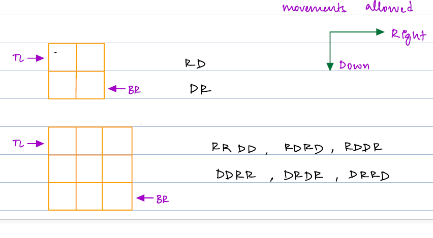

#### Observation
     N= Row, M = Column
     if we want to move N-1,M-1 to 0,0 , we can reach by N-1,M-2 or N-2, M-1

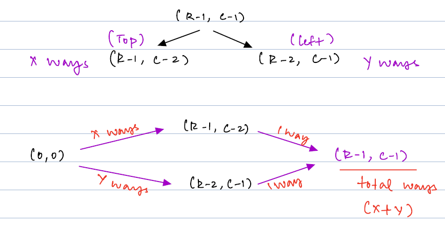

#### Brute force Approach
```java
int ways(int r, int c) {
    if(r==0 || c==0) return 1;
    int top = ways(r-1,c);
    int left = ways(r,c-1);
    return top + left;
}
```
T.C: O(2^r*c) , S.C: O(r*c)

#### Dynamic Programming Approach (Memoization)

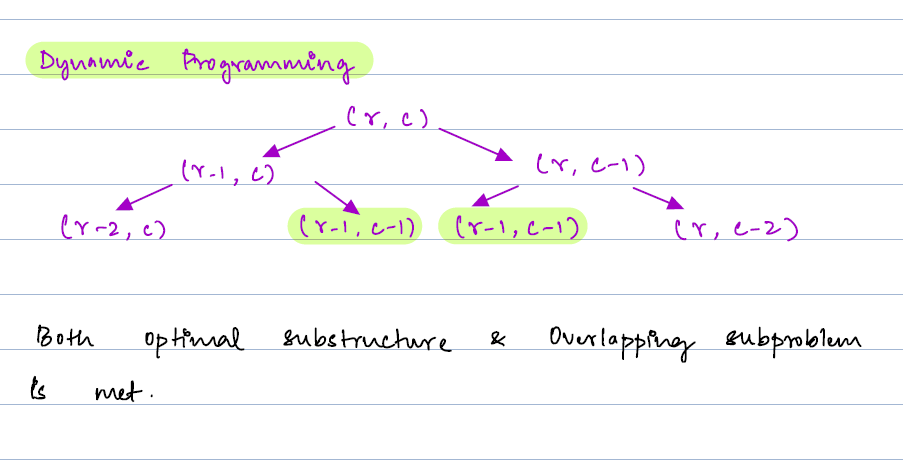

```java
int[][] dp = new int[r][c];
//initialize to dp with -1
int ways(int r, int c) {
    if(r==0 || c==0) return 1;
    if(dp[r][c] !=-1) return dp[r][c];
    int top = ways(r-1,c);
    int left = ways(r,c-1);
    dp[r][c] = top+ left;
    return dp[r][c];
}
```
T.C : O(r*c), S.C : O(r*c)

#### Iterative approach - Smallest to bigger
```java
int ways(int r, int c) {
    int[][] dp = new int[r][c];
    dp[0][0] = 1;
    for (int i = 0; i < r; i++) {
        for(int j=0;j<c;j++) {
            if(i==0 || j==0) dp[i][j]=1;
            else dp[i][j] = dp[i-1][j] + dp[i][j-1];
        }

    }
}
```
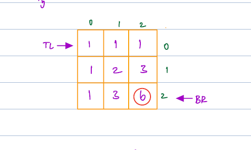

#### Q. Find total no.of ways to reach BR from TL with obstacles (0 represents obstacle, 1 represent free) 
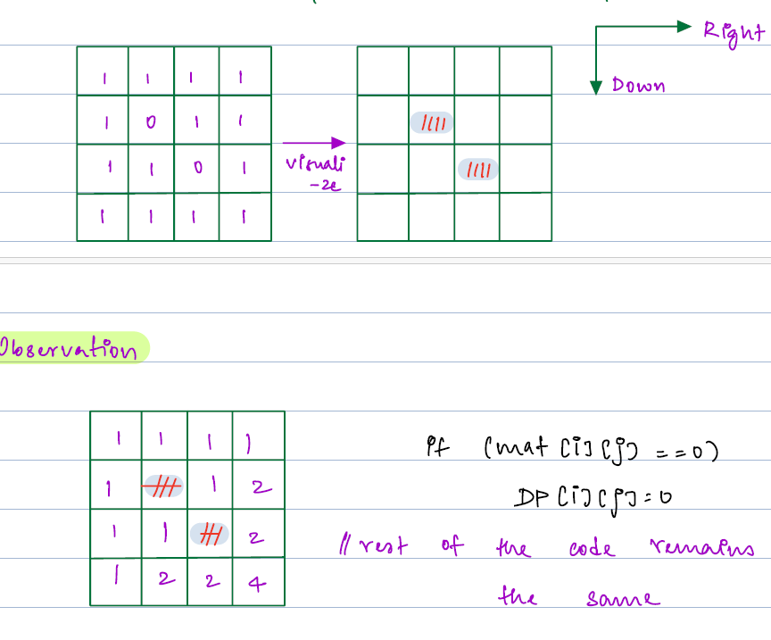

#### Observation : Where we found cell value equal to zero in matrix, will store zero in dp

```java
int ways(int r, int c) {
    int[][] dp = new int[r][c];
    dp[0][0] = 1;
    for(int i=0;i<r;i++) {
        for(int j=0;j<c;j++) {
            if(mat[i][j]==0) dp[i][j] =0;
            if(i==0 || j==0) dp[i][j] =1;
            else dp[i][j] = dp[i-1][j] + dp[i][j-1];
        }
    }
}
```

#### Q. Dungeons and princes
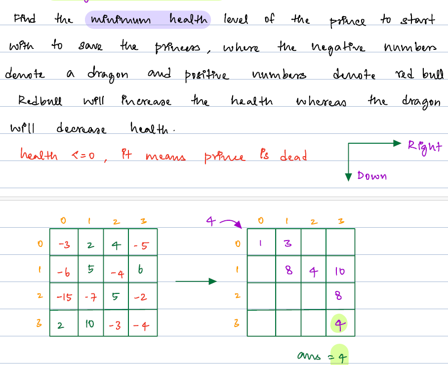

#### Observation : Greedy Approach wil not work. if we choose max value from right and down cell.
####               Because. wec don't know the next cell value, either its negative or positive.

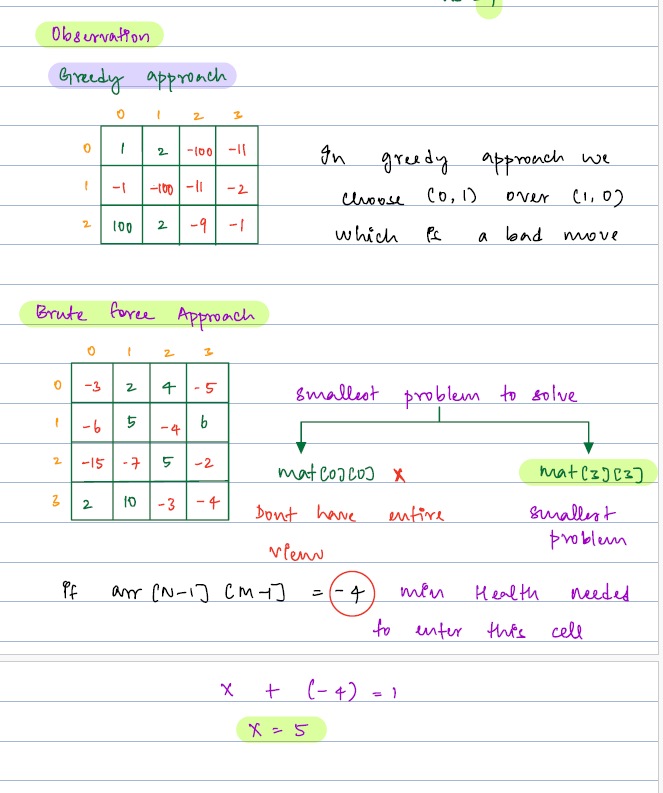
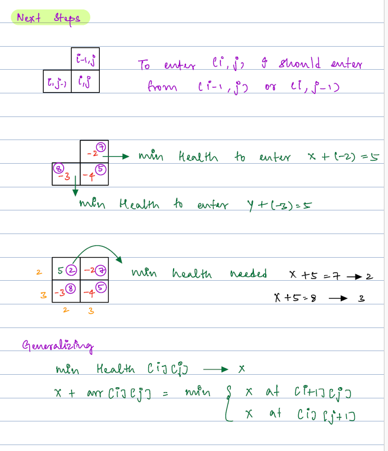
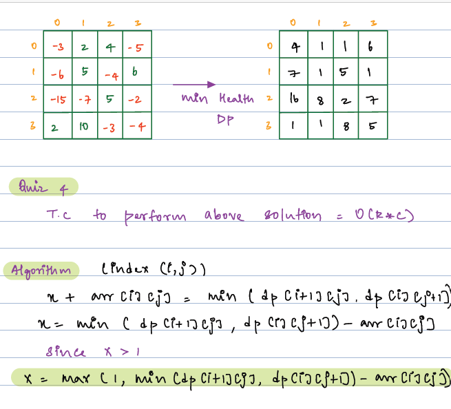

##### Approach:
      We need to choose nearest cell from princes cell, if princes cell is mat[n-1][m-1].
      we can choose mat[n-1][m-2] or mat[n-2][m-1] with minmum energy, when we enter to princes cell
      enegy should be at least 1.

```java
int[][] dp = new int[n][m];
//initialize with zero
 if(arr[n-1][m-1] > 0 ) dp[n-1][m-1] = 1;
 else dp[n-1][m-1] = 1 + Math.abs(arr[n-1][m-1]);
 
 // fill the last column and last row
for(i= n-2 ;i>=0;i--) {
    for(j=m-2; j>=0;j--) {
        dp[i][j] = Math.max(1,Math.min(dp[i+1][j],dp[i][j+1])-arr[i][j]);
    }
}
return dp[0][0];
```
T.C : O(n*m), S.C : O(n*m)

