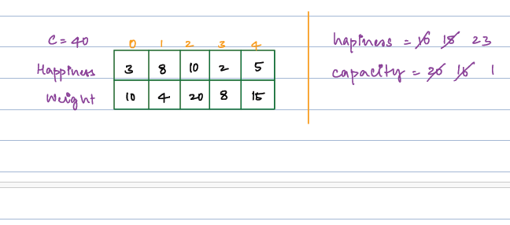
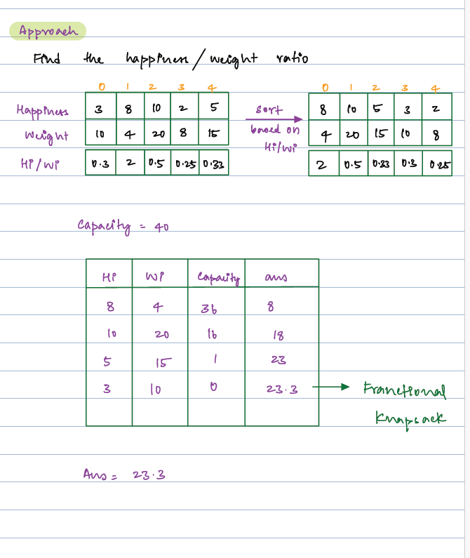
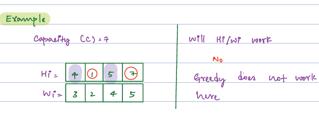
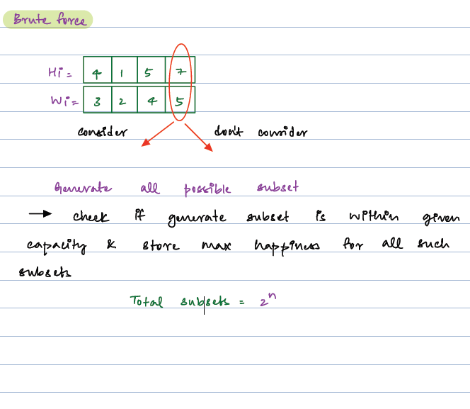
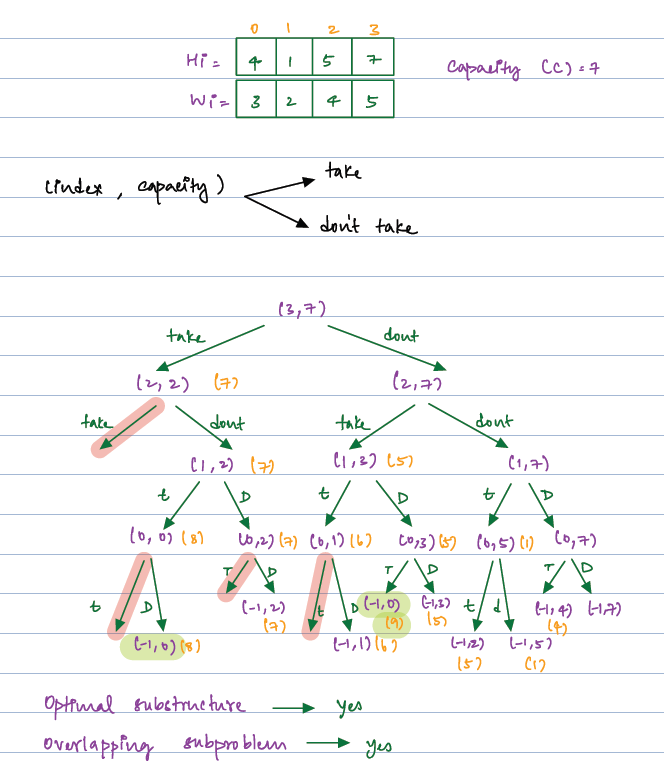
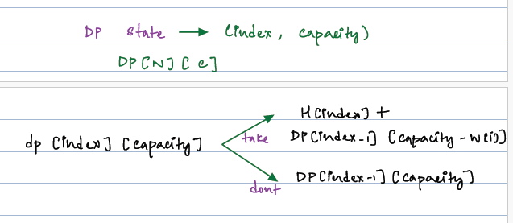
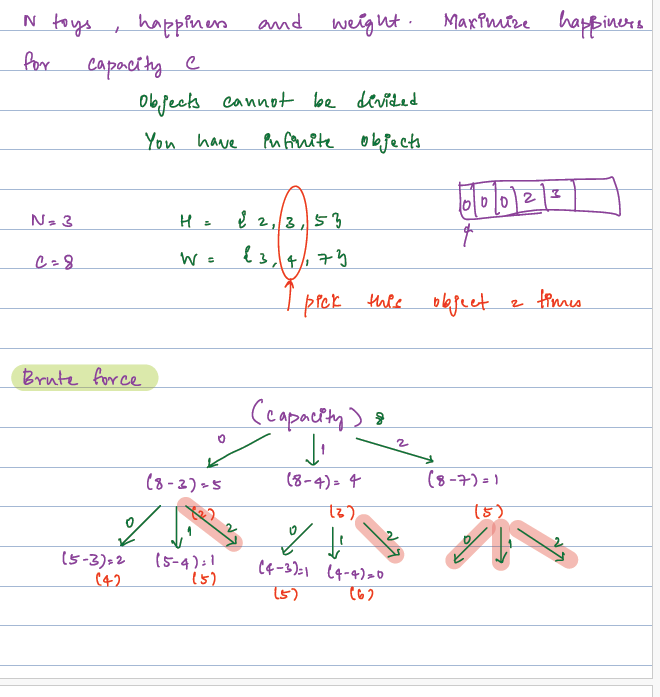

#### Topic for Discussion:
    Fractional Knapsack
    0-1 Knapsack
    Unbound Knapsack

#### Problem Description - Fractional knapsack
     Given N objects with their values Vi and their weight Wi.
     A Bag is given with capacity W that can be used to carry some objects such that the total
     sum of objects wights W and sum of profits in the bag is maximized or sum of losses in the 
     bag is minimized.

##### Approach
      Try Knapsack when
       1. Every object has two attributes value/weight.
       2. You are given a maximum capacity
#### Fractional Knapsack
     Given N cakes with happinnes and wights. Find maximum happiness that can be kept in bag with capacity C.
     {Cakes can be divided} Divisible item can come in fractional kanpsack.


####  
     We can try with greedy approach and trying to get maximum happiness.
     But we unable to maxke maximun happiness due to capacity of bag is full.
     Why ?  we can see those have maximun happiness they have high weight.

#### Solution Approach
     1. We need to calculate the unit of happines. 
     2. So, the ratio will be happiness/weight. we can consider this ration in diffent attribute.
     3. We can cost per item as attribute per ration.
     4. Will sort the items based on cost per item, then calculate the happiness



#### Solution

```java
import java.util.ArrayList;
import java.util.Comparator;

class Item {
    double cost;
    int happiness;
    int weight;

    public Item(int happiness, int weight) {
        this.weight = weight;
        this.happiness = happiness;
        this.cost = happiness / weight;
    }
}

// sort based on the cost in desc order;
int solve(ArrayList<Integer> A, ArrayList<Integer> B, int C) {
    ArrayList<Item> list = new ArrayList<>();
    for (int i = 0; i < A.size(); i++) {
        list.add(new Item(A.get(i), B.get(i)));
    }
    list.sort(Comparator.comparingDouble(val-> val.cost).reversed());
    duble ans = 0.0;
    for( int i=0;i<A.size();i++) {
        if(C== 0) break;
        else if(list.get(i).weight <= C) {
            C -= list.get(i).weight;
            ans +=  list.get(i).happiness;
        } else {
            ans += C *  list.get(i).cost;
            break;
        }
    }
    return (int) Double.parseDouble(String.format("%2f",ans *100));

}
```
T.C : O(nlogn), S.C : O(N)

#### Problem Description - 0/1 Knapsack
     Given two integer arrays A and B of size N each which represent values and weights associated with N items respectively.
     Also given an integer C which represents knapsack capacity.
     Find out the maximum value subset of A such that sum of the weights of this subset is smaller than or equal to C.

     NOTE: You cannot break an item, either pick the complete item, or don’t pick it (0-1 property).

#### Approach
     we can't choose greedy approach , because not able to maximize values.


#### Approach Brute Force
     In this approach either need to take the item or leave the item.



      
     
#### Solution Approach
```java
int[][] dp = new int[N][capacity];

int solve (int[] value, int[] weight, int capacity, int index) {
    if(index < 0) return 0;
    if(dp[index][capacity] != -1) return dp[index][capacity];
    int notTake = solve(value,weight,capacity,index-1);
    int take =0;
    if(capacity >= weight[index]) {
        take = solve(value,weight,capacity-weight[i],index-1) + value[i];
    }
    dp[index][capacity] = Math.max(take,notTake);
    return dp[index][capacity];
}
```
T.C : O(NxCapacity), S.C: O(NxCapacity)

#### Problem Description - Unbounded Knapsack
     1. Object can not be didvided.
     2. You have infinite objects. we can choose any object any number of time.



```java
import java.awt.color.ICC_ColorSpace;

int[] dp = new int[capacity + 1];
Arrays.fill(dp,-1);

public int  solve(int[] H, int[] W, int capacity) {
    int N = H.length;
    for (int i = 0; i <= capacity; i++) {
        for (int j = 0; j < N; j++) {
            if(i >= W[j]) {
                dp[i] = Math.max(dp[i],H[i] + dp[i-W[j]]);
            }
        }
    }
    return dp[w];

}

```
T.C :(NxCapacity), S.C : O(Capacity);
