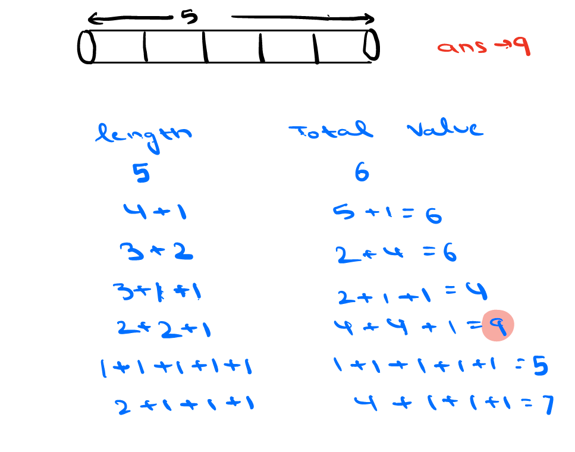
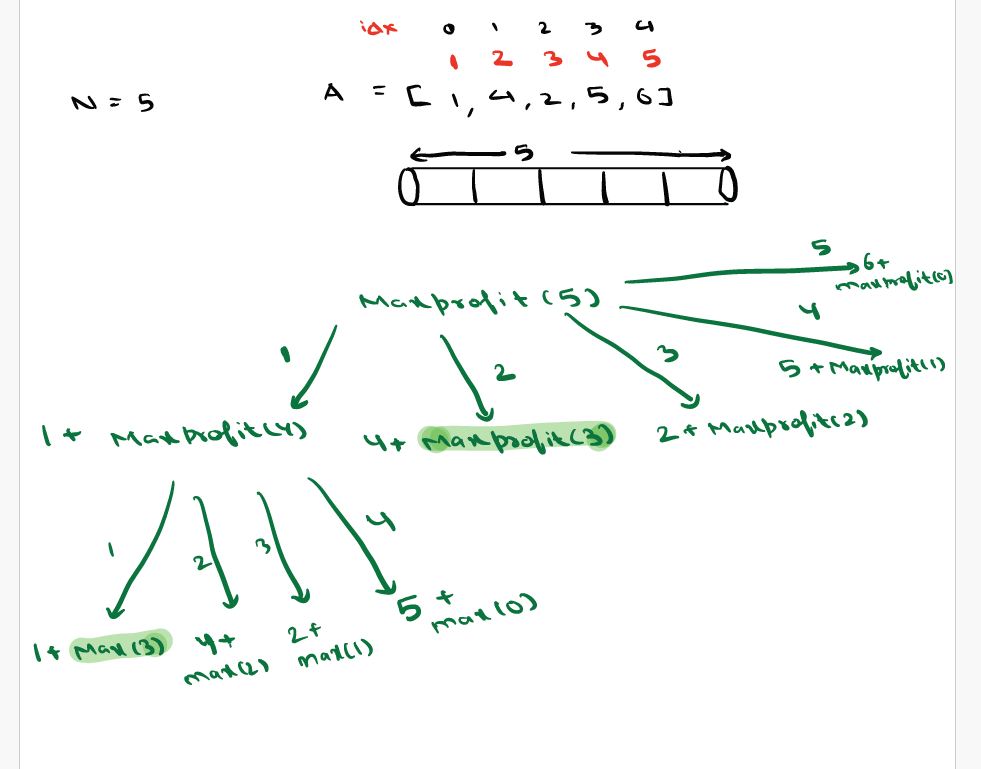

###Agenda:
1. Cutting the Rod
2. Coin change I/II
3. Extended 0-1 Knapsack

Fractional - Greedy Approach
0-1        - DP
0-infinity/unbounded - DP

###Problem: 1
Given a rod of length N, and an array of rod length N,where A[i] = price of (i+1) length rod.
Find maximum value we can obtain by selling rod.

Approach:            0 1 2 3 4 - index of Array
N=5                  1 2 3 4 5 - Rod len
                  A=[1,4,2,5,6]- Rod len price




```java
 int[] dp = new int[N+1];
dp[i] =  max profit we can get by selling a rod of len i