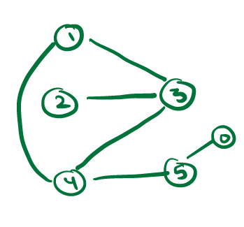
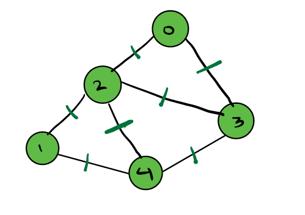
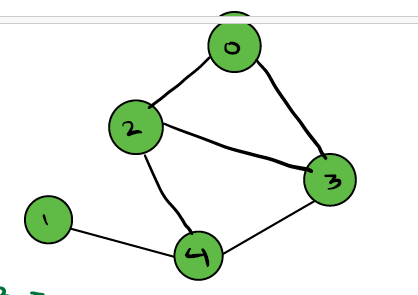

### Agenda :
    1. What are graph.
    2. Graph Representation
    3. BFS 
    4. DFS
    5. Find Cycle in Detected Graph

####Graph : 
    A Graph is collection of nodes connected to each other using their edges.

    Tree is Directed Graph. N nodes having N-1 edges.

#### Example :
    Instagraph A-----> B , It's Directed Graph
    Facbook    A------ B, It,s Unidirected or Unweighted Graph.
    City       Banglore ---------2000 Km------ Patna , It's Weighted Graph
    

### Classification Of Graph
    1. Directed Graph :  A graph is connected with nodes with directed edges or in one direction.
    2. Undirected Graph : A graph is connected with nodes with undirected edges or in unidirection.
    3. Weighted Graph: A graph is connected with edges with having weight or cost in edges.
    4. Unweighted Graph:  A graph is connected with edges without having weight or cost in edges.
    5. Cycle Graph: A graph is start with node and you can reach same node again without repeating any edges.
    6. ACycle Graph: A graph is start with node and you can not reach same node again without repeating any edges. 

#### Degree of node
     1. Indegree : No. of edges which are coming into that node.
        Example : Indegree (C) = 2
        
     2. Outdegree : No. of edges which aee going out to that node.
        Example : Outdegree (C) = 0  , Outdegree (A) = 2

#### Simple Graph :
     A Graph in which there is  no self loop and no multiple edges between any two nodes.

### Problems:
    1. Given an undirectional graph with N nodes and M edges.
       N= 6, M =6 
    Notes : Index start with 0 or 1.

        N    M   
        2    3
        4    5
        0    5
        4    1
        1    3
        3    4

#### Storing a graph :
     N = Node, M = Edge
     Input N=5 ,M=7
        N   M
        1   4
        2   0
        3   2
        4   3
        2   4
        3   0
        1   2
#### Representation 1:   Undirected graph in Adjancy Matrix
     

    
    
     
     In undirected graph adjMat[3][2] = 1 and adjmat[2][3] = 1
     In directed graph adjMat[3][2] = 1 and adjmat[2][3] = 0

     Adjancy Matrix take more space in memory, We need create to N * N matrix.
     if we store directed graph in matrix more space will be unused.

#### Representation 2:   Undirected graph in Adjancy List
 
 
    Input  N= 5, M=6
    N   M
    1   4
    2   0
    3   2
    4   3
    2   4   
    3   0

