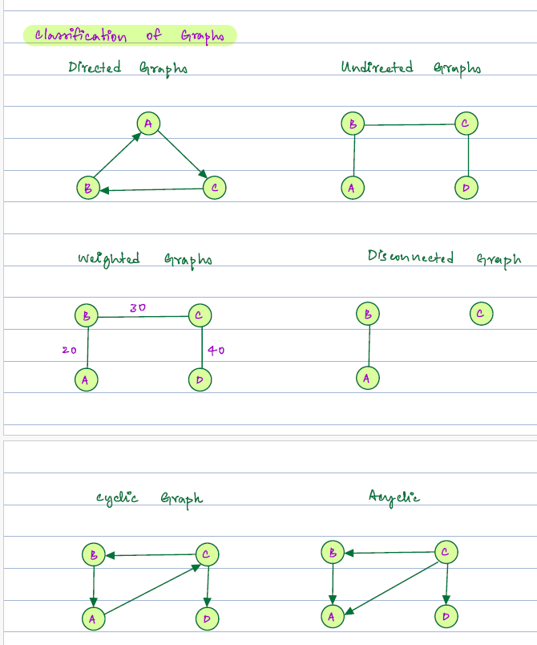
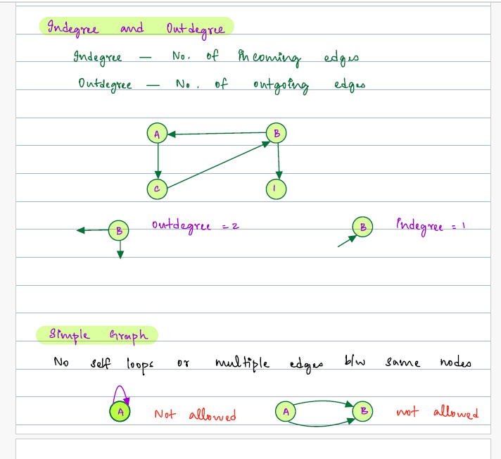
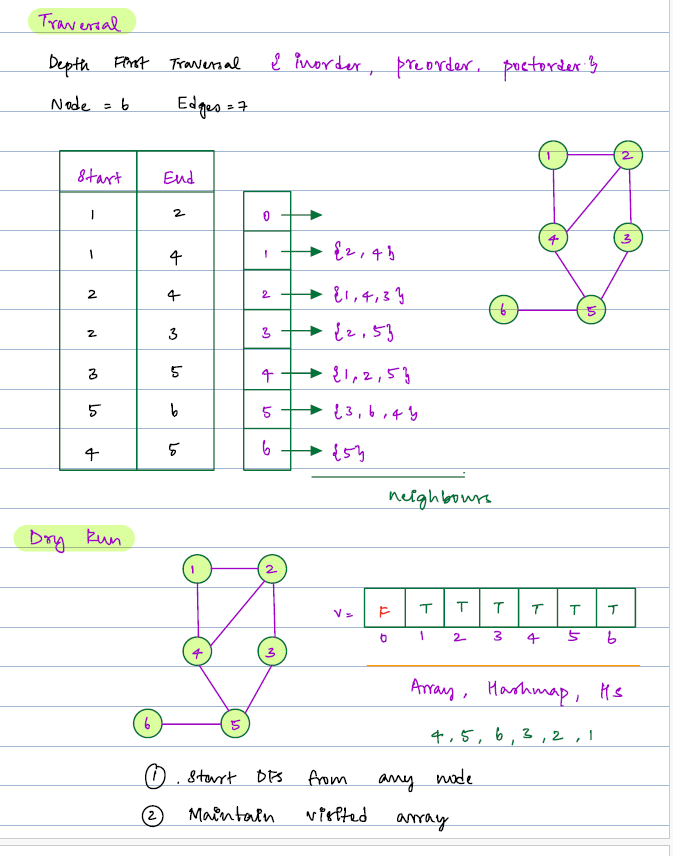
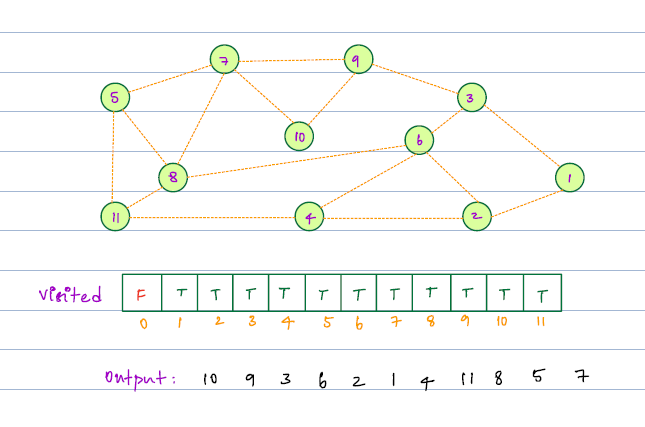
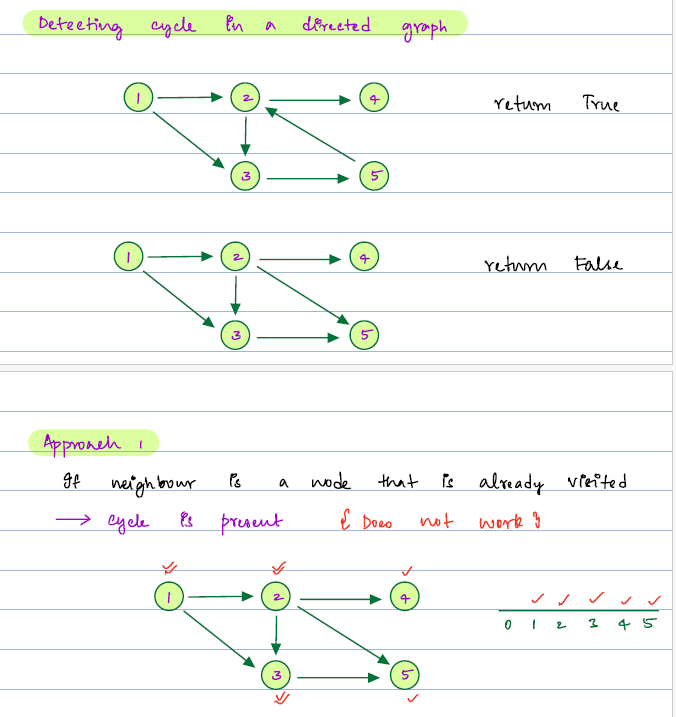
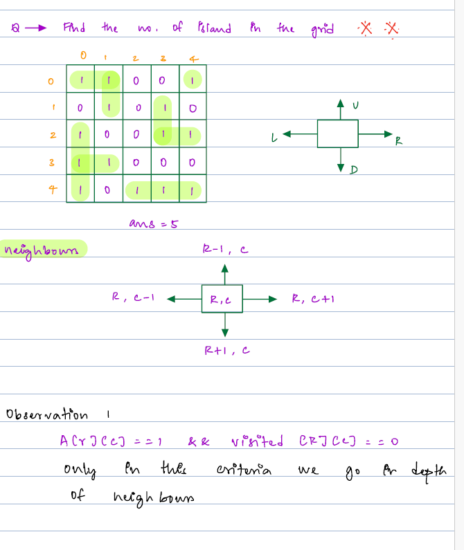

#### What is Graph ?
     It is collection of nodes, those nodes are are connected with each other using their edges.
     One node can be connected with multiple node using edges.

#### Classification of Graph ?
     1. Directed Graph  2. Unidirected Graph
     3. Weighted Graph  4. Disconnected Graph
     5. Cyclic Graph    6. Acyclic Graph



#### Degree of Graph ?
    1. Indegree : Number of incoming edges.
    2. Outdegree : Number of outgoing edges.

#### Simple Graph :
     A Graph have no self loops and no multiple edges between same node.


#### Storing A Graph
     We can use adajncy Matrix or adancy list. 
     In adjancy matrix memory wastage will be there , if we do not have edges between them.
     Ajacny list is optimal way of storing Graph nodes and edges.

#### Pseudo Code
     Adjacny List : S.C : O(N+E) , Ajancy Matrix : S.C : O(N*E)

```java
    public ArrayList<ArrayList<Integer>> createList(ArrayList<ArrayList<Integer>> input, int node) {
        ArrayList<ArrayList<Integer>> list = new ArrayList<>();
        for (int i = 0; i <= node; i++) {
            list.add(new ArrayList<>());
        }
        for(int i = 0;i < input.size(); i++) {
            int src = input.get(i).get(0);
            int dest = input.get(i).get(1);
            list.get(src).add(dest);
            list.get(dest).add(src);
        }
        return list;
    }
```

#### Depth First Traversal of Graph - Pseudo Code 
     T.C :  O(N+E)


```java

// we are ready  with adancy list.
public class BreadthFirstSearchTraversal {
    boolean[] visited = null;
    public void processDFS(ArrayList<ArrayList<Integer>> input, int nodeCount) {
        visited = new boolean[nodeCount + 1];
        for (int i = 0; i <= nodeCount; i++) {
            visited[i] = false;
        }
       
        ArrayList<ArrayList<Integer>> adjancyList = AdjancyListStoreGraph.createList(input,nodeCount);
        for(int i = 1;i <= nodeCount; i++) {
            if(!visited[i]) dfs(i,adjancyList);
        }
    }

    public void dfs(int node,  ArrayList<ArrayList<Integer>> adjancyList) {
        visited[node] = true;
        for(int edge : adjancyList.get(node)) {
            if(!visited[edge]) dfs(edge,adjancyList);
        }
    }
}
```
#### Dry Run


#### Detect Cycle in directed Graph -
     If same node again visited in path of src node, then its have cycle.
     T.C : O(N+E)

```java
//Approach 2
public class CycleInDirectedGraph {
    static boolean hasCycle = false;
    public static void main(String[] args) {
      int A=2;
      int[][] B = {{1,2}};
      System.out.println(solve(A,B));
    }
    public static int solve(int A, int[][] B) {
        List<List<Integer>> list = Arrays.stream(B)
                .map(row -> Arrays.stream(row).boxed().collect(Collectors.toList()))
                .collect(Collectors.toList());
        ArrayList<ArrayList<Integer>>  adjList = createList(list,A);
        boolean[] visited = new boolean[A+1];
        Arrays.fill(visited,false);
        HashSet<Integer> paths = new HashSet<>();
        for(int i=1;i<=A;i++) {
            if (!visited[i]) dfs(i,adjList,visited,paths);
            
        }
        return hasCycle ? 1: 0;
    }

    public static void dfs (int edge,ArrayList<ArrayList<Integer>>  adjList, boolean[] visited, HashSet<Integer> paths) {
        paths.add(edge);
        visited[edge] = true;
        for(int value : adjList.get(edge)) {
            if(paths.contains(value)) hasCycle = true;
            if(!visited[value]) dfs(value,adjList,visited,paths);
        }
        paths.remove(edge);
    }

    public static ArrayList<ArrayList<Integer>> createList(List<List<Integer>> input, int node) {
        ArrayList<ArrayList<Integer>> list = new ArrayList<>();
        for (int i = 0; i <= node; i++) list.add(new ArrayList<>());
        
        for(int i=0;i<input.size(); i++) {
            int src = input.get(i).get(0);
            int dest = input.get(i).get(1);
            list.get(src).add(dest);
        }
        return list;
    }
}
```

#### Find the number of island in the grid ?

 ```java
public class NumberOfIslands {
    public int solve(int[][] A) {
        int row = A.length, col = A[0].length;
        int count=0;
        for(int i=0;i<row;i++) {
            for (int j=0;j< col;j++) {
                if(A[i][j]==1) {
                    count ++;
                    dfs(A,i,j);
                }
            }
        }
        return count;
    }
    public void dfs(int[][] A, int row, int col) {
        if(row < 0 || col < 0 || row >= A.length || col >= A[0].length || A[row][col] != 1)  return;
        A[row][col] = 2;
        dfs(A,row-1,col);
        dfs(A,row,col-1);

        dfs(A,row+1,col);
        dfs(A,row,col+1);

        dfs(A,row-1,col-1);
        dfs(A,row+1,col+1);

        dfs(A,row-1, col+1);
        dfs(A,row+1,col-1);
    }
}
```


