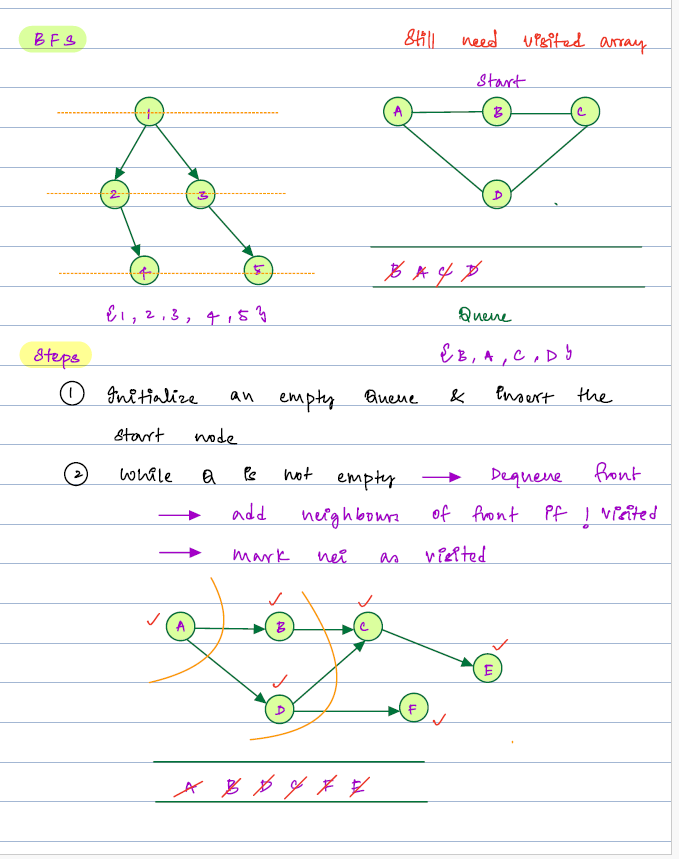

#### Agenda
     1. BFS - Breadth First Search
     2. MultiSource BFS
     3. Rotten Oranges
     4. Possibilities fo finishing courses
     5. Topological sort

#### BFS 
     It is level order traversal.
#### BFS Implementation : 
     1. Initialize the empty queue and add the first element.
     2. While queue is not empty , remove the first element
     3. Now insert the neighour of the element in queue if not visited.

T.C : O(n+e), S.C : O(n)
```java
    public void bfsGraph(List<List<Integer>> input, int node) {
        ArrayList<ArrayList<Integer>> adjList = createList(input,node);
        boolean[] visited = new boolean[node +1];
        Queue<Integer> queue = new ArrayDeque<>();
        int startNode = 1;//assume
        queue.add(startNode);
        while(!queue.isEmpty()) {
            int poll = queue.poll();
            visited[poll] = true;
            for (int nbr :adjList.get(poll)) {
                if (!visited[nbr]) queue.add(nbr);
            }
        }
    }
    
 ```   


#### MultiSource BFS


     
    
