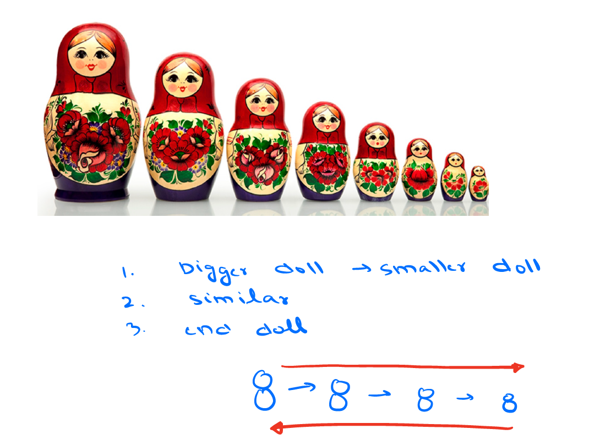

#### Agenda:
     1. What is Recusrsion.
     2. How to write recusrsive code.
     3. Function call Tracing.
     4. 3 Problems
     5. TC and SC

Recursion : - Solving larger problems using smaller similar subproblems.

Sum[N] = 1+2+3+4+5+.....+N-1+N

Sum[N] = Sum[N-1] + N -> Recursive rotation.

Ques: Write Recursive function for sum of N natural numbers.

Assumption : Decide what your function does.

